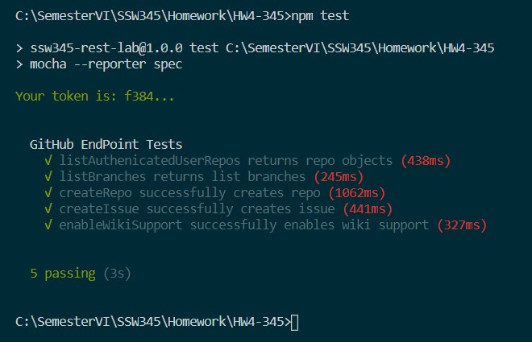
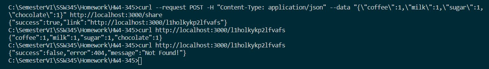

# HW4 Answers
"I pledge my Honor that I have abided by the Stevens Honor System." - Leena Domadia

### Summary
This was by far the most difficult homework assignment I have had in this semester. I do not have any experience writing in JavaScript, so I struggled throughout this entire assignment. I don't know what `await`, `return new Promise`, `request`, `resolve`, or any of the functions that were used in this assignment do. The GitHub API documents were not helpful at all. I wish we were taught in class about all these functions and what they do behind the scenes rather than me trying to Google search, looking at StackOverflow, trying to find help but unable to find anything.

### Things I Learned
* `curl` statements work on Windows in Command Prompt, not in Powershell

### REST Client
test.js passing:

### REST Server
command outputs:
